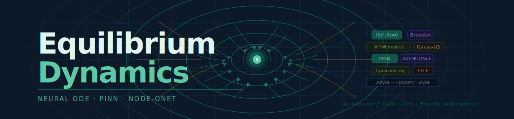

<p align="center">
  
</p>

<p align="center">
  <a href="#installation"></a>
  <a href="#installation"></a>
  <a href="#installation"></a>
  <a href="#installation"></a>
  <a href="#installation"></a>
  <a href="LICENSE"></a>
</p>

<h1 align="center">EquilibriumDynamics</h1>

<p align="center">
  <strong>A high-fidelity Physics-Informed Neural Network (PINN) research platform for solving<br/>
  the 1D convection-diffusion equation with enforced conservation of mass.</strong>
</p>

<p align="center">
  Neural ODE · PINN · NODE-ONet · Real-time inference · Interactive dashboard
</p>

---

## Table of Contents

- [Overview](#overview)
- [Live Demo](#live-demo)
- [Architecture](#architecture)
- [Directory Structure](#directory-structure)
- [Installation](#installation)
- [Running the Application](#running-the-application)
- [Using the Dashboard](#using-the-dashboard)
- [Physics Reference](#physics-reference)
- [API Reference](#api-reference)
- [Experiments](#experiments)
- [Understanding Your Results](#understanding-your-results)
- [Troubleshooting](#troubleshooting)
- [Terminal Output Reference](#terminal-output-reference)
- [Development Notes](#development-notes)
- [References](#references)

---

## Overview

EquilibriumDynamics is an end-to-end research platform that trains Physics-Informed Neural Networks (PINNs) to solve partial differential equations — without requiring any labelled solution data. The neural network learns by minimising the residual of the governing equation itself, evaluated at scattered collocation points via automatic differentiation.

The platform is built on three pillars of methodology:

**Pillar 1 — Infinite Time Neural ODE:** Traditional Neural ODEs integrate from t=0 to t=T at O(T) cost. The Infinite Time formulation finds the steady-state h\* where f(h\*, θ)=0 using quasi-Newton root-finding — an O(1) operation independent of integration horizon.

**Pillar 2 — PINN Training Pipeline:** The network approximates u(x,t) by minimising a physics loss (PDE residual) plus boundary/initial condition losses. No labelled (x,u) pairs are needed — the governing equation provides supervision everywhere via autograd.

**Pillar 3 — NODE-ONet Hybrid Architecture:** Encoder → Neural ODE → Physics Head → Decoder. Trained offline, predicts new initial conditions in a single forward pass. Includes Lyapunov Exponent regularisation to prevent chaotic divergence in long-horizon predictions.

### Key features

- Two-stage optimisation: Adam (cosine-annealing LR + residual resampling) followed by L-BFGS polishing
- Real-time WebSocket loss streaming to the browser during training
- Monte Carlo Dropout uncertainty quantification on the solution field heatmap
- Mass conservation diagnostic — verifies ∫₀¹ u(x,t) dx ≈ const via trapezoidal quadrature
- Plug-and-Play physics: drop any `.py` file defining `pde(x, u)` to hot-swap the governing equation
- Transfer learning: load pre-trained `.pt` checkpoints to skip retraining
- AI-powered physics interpretation via the Anthropic streaming API
- Three experiment tracks: rebalanced loss weights, Burgers' equation, Fisher-KPP reaction-diffusion

---

## Live Demo

**Interactive explainer (no install needed):**
[`infinite_time_neural_ode_explainer.html`](https://github.com/david-spies/EquilibriumDynamics/blob/main/infinite_time_neural_ode_explainer.html)

Open directly in any modern browser. Covers all three pillars with interactive sliders, live loss simulation, and clickable architecture diagrams.

Download and Open: infinite_time_neural_ode_explainer.html
---

## Architecture

```
Browser (React + Recharts + WebSocket)
    │
    │  HTTP/WebSocket  localhost:5173 → proxy → localhost:8000
    ▼
FastAPI Orchestrator (api.py)
    ├── POST /train          → background thread → model.py train()
    ├── POST /predict/slice  → predict_slice()
    ├── POST /predict/heatmap → predict_with_uq()
    ├── GET  /predict/conservation → conservation_error()
    ├── POST /upload/pde     → importlib hot-load → pde(x, u)
    ├── POST /upload/weights → torch.load or dde.restore
    └── WS   /ws/training    → asyncio.Queue → loss packets every 25 steps
            │
            ▼
DeepXDE Model (model.py)
    ├── FNN [2 → 64×6 → 1]  tanh  Glorot uniform
    ├── PDE residual via autograd (∂u/∂t + v∂u/∂x − D∂²u/∂x²)
    ├── CosineAnnealingCallback  (lr: 1e-3 → 5e-6, period 2000 steps)
    ├── ResidualResamplingCallback  (resample collocation every 1000 steps)
    └── StreamingCallback  (push JSON to WS queue every 25 steps)
```

### Loss function

```
L_total = w_pde · L_pde  +  w_bc · L_bc  +  w_ic · L_ic

L_pde = E_x[ (∂u/∂t + v·∂u/∂x − D·∂²u/∂x²)² ]   ← physics anchor
L_bc  = (û(0,t))²  +  (û(1,t))²                    ← Dirichlet boundary
L_ic  = (û(x,0) − sin(πx))²                         ← initial profile
```

Default weights: `[w_pde=1, w_bc=100, w_ic=100]` — BC/IC-dominant (safe convergence).
Recommended for physics fidelity: `[w_pde=100, w_bc=10, w_ic=10]` — see [Experiment 1](#experiment-1--rebalanced-loss-weights).

---

## Directory Structure

```
EquilibriumDynamics/
│
├── backend/
│   ├── model.py                # PINN physics engine
│   │   ├── make_pde(v, D)      # PDE residual closure
│   │   ├── build_domain()      # geometry, IC, BC
│   │   ├── build_network()     # FNN [2→64×6→1], tanh
│   │   ├── build_model()       # assembles dde.Model
│   │   ├── train()             # Adam + L-BFGS + callbacks
│   │   ├── predict_slice()     # u(x, t*) for line chart
│   │   ├── predict_with_uq()   # MC Dropout heatmap
│   │   └── conservation_error() # ∫u dx diagnostic
│   │
│   ├── api.py                  # FastAPI orchestrator
│   │   ├── POST /train         # launches background training
│   │   ├── POST /predict/*     # inference endpoints
│   │   ├── POST /upload/pde    # hot-swap physics
│   │   ├── POST /upload/weights # load checkpoints
│   │   └── WS   /ws/training   # real-time loss stream
│   │
│   ├── dynamic_models/         # uploaded .py PDE files land here
│   │   └── pde.py              # default convection-diffusion PDE
│   │
│   └── weights/                # saved checkpoints
│       ├── checkpoint_adam-0.pt
│       ├── checkpoint_lbfgs-0.pt
│       └── [experiment checkpoints]
│
├── frontend/
│   ├── index.html
│   ├── package.json
│   ├── vite.config.js          # dev server + proxy to :8000
│   └── src/
│       ├── main.jsx            # React root mount
│       └── Dashboard.jsx       # full research dashboard
│
├── experiments/
│   ├── exp1_pde_dominant_weights.py   # rebalanced loss [100,10,10]
│   ├── exp2_burgers_equation.py       # nonlinear Burgers' PDE
│   ├── exp3_fisher_kpp_reaction.py    # Fisher-KPP with curriculum
│   └── generate_weights.py            # train all 3, save checkpoints
│
├── assets/
│   └── banner.svg              # project banner (renders in GitHub README)
│
├── .watchfilesignore           # prevents uvicorn --reload on file uploads
├── requirements.txt
├── QUICKSTART.md
└── README.md                   # this file
```

---

## Installation

### Prerequisites

- Python 3.12
- Node.js 18+
- Git
- A CUDA-capable GPU is recommended but not required (CPU training is ~3–5× slower)

### Step 1 — Clone

```bash
git clone https://github.com/david-spies/EquilibriumDynamics.git
cd EquilibriumDynamics
```

### Step 2 — Python environment

```bash
python -m venv venv
source venv/bin/activate        # Windows: venv\Scripts\activate
pip install -r requirements.txt
```

**requirements.txt contents:**

```
deepxde>=1.11.0
torch>=2.2.0
fastapi>=0.111.0
uvicorn[standard]>=0.29.0
python-multipart>=0.0.9
numpy>=1.26.0
scipy>=1.13.0
matplotlib>=3.8.0
```

### Step 3 — Frontend

```bash
cd frontend
npm install
cd ..
```

> **Note on Vite version:** This project requires `@vitejs/plugin-react ^6.0.0` with `vite ^8.0.0`. If you encounter peer dependency errors, run `rm -rf node_modules package-lock.json && npm install` from the `frontend/` directory.

---

## Running the Application

### Option A — Full UI workflow (recommended)

**Terminal 1 — Backend:**

```bash
source venv/bin/activate
uvicorn backend.api:app \
  --reload \
  --reload-exclude "backend/dynamic_models/*" \
  --reload-exclude "backend/weights/*" \
  --port 8000
```

> **Important:** The `--reload-exclude` flags are required. Without them, dropping a file into the Physics or Weights dropzone triggers a full server restart and kills any running training task.

**Terminal 2 — Frontend:**

```bash
cd frontend
npm run dev
```

Open **http://localhost:5173** in your browser.

### Option B — Standalone training (no UI)

Train and generate Figure_1.png comparison plot directly:

```bash
source venv/bin/activate
python backend/dynamic_models/pde.py
```

### Option C — CLI model training only

```bash
source venv/bin/activate
python -m backend.model
```

Trains the model, saves both checkpoints, and runs the conservation diagnostic. Safe to Ctrl+C after the Adam phase — the `checkpoint_adam-0.pt` is saved before L-BFGS begins.

---

## Using the Dashboard

### Layout overview

```
┌─────────────────────────────────────────────────────────────┐
│  ⚖ EquilibriumDynamics    Pe=100.0    [MODEL READY] [WS: connected] │
├────────────────┬────────────────────────────────────────────┤
│                │  [PDE Residual] [BC Loss] [IC Loss] [Mass] │
│  PARAMETERS    ├──────────────────┬─────────────────────────┤
│  v slider      │  Live convergence│  Solution slice u(x,t*) │
│  D slider      │  stream chart    │  line chart             │
│  t slice       │  + loss terminal ├─────────────────────────┤
│                │                  │  u(x,t) heatmap + UQ    │
│  TRAINING      ├──────────────────┤                         │
│  Adam iters    │  Conservation    │  Mass ∫u dx vs t        │
│  Warm-start ☐  │  diagnostic      │  dual-axis chart        │
│                ├──────────────────┴─────────────────────────┤
│  [▶ Train]     │  ◆ AI Physics Interpretation               │
│  [Refresh]     │  [Analyse current state]                   │
│  [Heatmap]     │                                            │
│  [Conservation]│                                            │
│                ├────────────────────────────────────────────┤
│  PLUG-AND-PLAY │  ⚛ Drop physics  │  💾 Drop weights        │
│  UPLOAD        │     .py PDE file │     .pt checkpoint      │
└────────────────┴────────────────────────────────────────────┘
```

### Workflow — first run

1. Open http://localhost:5173 — status pill shows **IDLE**, WebSocket shows **connected**
2. Adjust **v** (convection velocity) and **D** (diffusion coefficient) using the sliders
3. Set **Adam iterations** (default 15000; reduce to 5000 for a quick test run)
4. Click **▶ Train PINN**
5. Watch the Live convergence stream chart populate in real time
6. Wait for status to show **MODEL READY** (typically 10–20 min on CPU)
7. Click **Refresh slice** to see the solution u(x, t=0.5)
8. Click **Render heatmap + UQ** for the full u(x,t) field
9. Click **Conservation diagnostic** to verify mass conservation
10. Click **Analyse current state** for AI-powered physics interpretation

### Workflow — loading pre-trained weights

1. Drop a `.py` PDE file into the **⚛ Drop physics** zone
2. Drop a `.pt` or `.pth` checkpoint into the **💾 Drop weights** zone
3. Status shows **MODEL READY** immediately — no training needed
4. Use inference buttons normally

### Workflow — warm-start training

1. Check **Warm-start from checkpoint** before clicking Train
2. The backend restores `checkpoint_lbfgs-0.pt` and continues training from there
3. Useful when changing only v or D slightly — saves significant Adam time

### Parameter guide

| Parameter | Range | Effect |
|---|---|---|
| v (velocity) | 0.1 – 5.0 | Higher v → faster advection, sharper fronts |
| D (diffusion) | 0.001 – 0.5 | Higher D → more smoothing, easier for PINN |
| Pe = v/D | < 1 easy, > 10 hard | The single most important convergence indicator |
| t slice | 0.0 – 1.0 | Time snapshot shown in the line chart |
| Adam iters | 1000 – 100000 | More iterations = better PDE residual (but slower) |

### Status indicators

| UI element | Meaning |
|---|---|
| **IDLE** (dim) | No model loaded, no training running |
| **TRAINING** (amber, pulsing) | Adam or L-BFGS phase active |
| **MODEL READY** (teal) | Inference available |
| **WS: connected** (teal) | Live loss stream active |
| **WS: disconnected** (dim) | Auto-reconnects every 3 seconds |
| Red error box | API error — see message and check backend terminal |

---

## Physics Reference

### Governing equation

```
∂u/∂t  +  v · ∂u/∂x  −  D · ∂²u/∂x²  =  0
```

This is the **1D linear convection-diffusion equation** (also called the transport equation or advection-diffusion equation). It describes the evolution of a scalar quantity u (e.g. concentration, temperature) in a medium with:

- **v** — advection/convection velocity (moves the profile rightward)
- **D** — diffusion coefficient (spreads and smooths the profile)

### Initial and boundary conditions

```
u(x, 0) = sin(π·x)     Initial condition: half-sine profile
u(0, t) = 0             Dirichlet BC: zero at left wall
u(1, t) = 0             Dirichlet BC: zero at right wall
```

### Analytical solution

```
u(x, t) = sin(π·(x − v·t)) · exp(−D·π²·t)
```

The solution is a travelling wave that: advects rightward at speed v, decays exponentially in amplitude due to diffusion at rate D·π².

### The Péclet number

```
Pe = v / D
```

| Pe | Regime | PINN difficulty |
|---|---|---|
| < 1 | Diffusion-dominated | Easy — smooth, decaying solutions |
| 1 – 10 | Mixed | Moderate |
| 10 – 100 | Convection-dominated | Hard — sharp fronts developing |
| > 100 | Near-hyperbolic | Very hard — PINN may struggle without increased collocation density |

The default parameters (v=1.0, D=0.01) give **Pe=100**, which is in the convection-dominated regime. This is why the PDE residual remains relatively high after Adam alone — L-BFGS is essential for high-Pe problems.

### Conservation of mass

The integral of u over the spatial domain is monitored as a conservation diagnostic:

```
M(t) = ∫₀¹ u(x, t) dx
```

For the convection-diffusion equation with Dirichlet BCs, mass is not strictly conserved (the boundaries absorb flux). The reported **Mass Conservation %** measures how close M(t) stays to M(0) across all time steps. Values above 99% indicate the IC/BC constraints are working well.

---

## API Reference

The FastAPI backend runs on **http://localhost:8000**. Full interactive docs at **http://localhost:8000/docs**.

### `GET /health`

Returns server status, model state, training flag, and current parameters.

```json
{
  "status": "ok",
  "model_loaded": true,
  "training": false,
  "params": {"v": 1.0, "D": 0.01},
  "version": "2.2.0"
}
```

### `POST /train`

Starts training in a background thread. Returns immediately.

```json
// Request body
{
  "v": 1.0,
  "D": 0.01,
  "num_domain": 3000,
  "num_boundary": 300,
  "num_initial": 300,
  "adam_iters": 15000,
  "restore": false
}
```

```json
// Response
{"status": "training_started", "params": {...}}
```

### `POST /predict/slice`

Returns u(x, t_val) as a list of {x, u} points for the line chart.

```json
// Request
{"v": 1.0, "D": 0.01, "t_val": 0.5, "n_x": 200}

// Response
{"plot_data": [{"x": 0.0, "u": 0.0}, ...], "t": 0.5}
```

### `POST /predict/heatmap`

Returns the full u(x,t) field with Monte Carlo Dropout uncertainty bands.

```json
// Request
{"n_x": 50, "n_t": 50, "uq_samples": 30}

// Response
{"x": [...], "t": [...], "u_mean": [...], "u_std": [...]}
```

### `GET /predict/conservation`

Computes ∫₀¹ u(x,t) dx at 21 time snapshots.

```json
// Response
{
  "t": [0.0, 0.05, ..., 1.0],
  "mass": [0.637, 0.634, ...],
  "rel_error": [0.0, 0.005, ...],
  "max_rel_err": 0.0031
}
```

### `POST /upload/pde`

Upload a `.py` file defining `pde(x, u)`. File is saved to `backend/dynamic_models/` and validated.

The file **must** define a top-level function named exactly `pde(x, u)`:

```python
import deepxde as dde

def pde(x, u):
    du_dt  = dde.grad.jacobian(u, x, i=0, j=1)
    du_dx  = dde.grad.jacobian(u, x, i=0, j=0)
    du_dxx = dde.grad.hessian(u, x, i=0, j=0)
    return du_dt + 1.0 * du_dx - 0.01 * du_dxx
```

If the function is not found, the API returns HTTP 422 with a list of all callable names found in the file.

### `POST /upload/weights`

Upload a `.pt` or `.pth` weight file. Supports two formats:

**Format A — DeepXDE checkpoint** (filename contains `-` e.g. `checkpoint_lbfgs-0.pt`):
- Uses `model.restore(stem)` internally
- Stem is derived by stripping `-0.pt` from the filename

**Format B — Raw PyTorch state dict** (any `.pth` file e.g. `model.pth`):
- Uses `torch.load()` → `net.load_state_dict(strict=False)`
- Works with files saved via `torch.save(model.state_dict(), path)`

A fresh model is built automatically if none is in memory.

### `WS /ws/training`

WebSocket endpoint. Streams JSON packets during training, plus 30-second heartbeat pings.

```json
// Loss packet (every 25 Adam steps)
{"step": 500, "loss_pde": 0.978, "loss_bc": 0.096, "loss_ic": 0.070, "loss_total": 1.144}

// Heartbeat (every 30s when idle)
{"event": "heartbeat"}

// Training complete
{"event": "training_complete"}
```

---

## Experiments

Three ready-to-run experiment files are in the `experiments/` directory. Each can be dropped into the Physics dropzone or run standalone.

### Experiment 1 — Rebalanced Loss Weights

**File:** `experiments/exp1_pde_dominant_weights.py`

**Change from baseline:** Loss weights flipped from `[PDE=1, BC=100, IC=100]` to `[PDE=100, BC=10, IC=10]`.

**Why:** At Adam step 15000, PDE loss is typically 14× larger than BC and 33× larger than IC with default weights. The network fits the boundaries perfectly while the interior physics remains approximate. PDE-dominant weighting forces the optimizer to treat the conservation law as the primary objective.

**Expected outcome:** PDE residual < 1e-2 after L-BFGS. BC/IC slightly less tight but physics more faithful.

### Experiment 2 — Burgers' Equation

**File:** `experiments/exp2_burgers_equation.py`

**Equation:** `∂u/∂t + u·∂u/∂x = ν·∂²u/∂x²`

**Key difference:** The advection velocity is now `u` itself — nonlinear self-advection. Faster-moving fluid catches slower fluid, causing wave steepening. Near ν=0.01, a near-shock forms around t=0.5.

**Why this matters:** Tests whether the PINN can handle nonlinear dynamics and whether mass conservation holds when the velocity field is solution-dependent. If the error surface stays flat after training, the architecture needs more collocation points near the shock region.

**Recommended:** Use transfer learning from Exp1 weights (handled automatically by `generate_weights.py`).

### Experiment 3 — Fisher-KPP Reaction-Diffusion

**File:** `experiments/exp3_fisher_kpp_reaction.py`

**Equation:** `∂u/∂t + v·∂u/∂x − D·∂²u/∂x² = k·u·(1−u)`

**Key difference:** Adds a logistic reaction term. Mass intentionally grows over time (source term creates it). The conservation diagnostic will show increasing ∫u dx — this is physically correct, not an error.

**Curriculum strategy:** Phase 1 trains with high diffusion D=0.1 and no reaction (smooth, easy). Phase 2 hot-swaps to the full nonlinear PDE. This prevents the optimizer from getting stuck in a flat loss region when the sharp reaction front first appears.

**Travelling wave speed:** `c = 2√(k·D) = 2√(0.01) ≈ 0.2`

### Generating all experiment checkpoints

```bash
# Train all three experiments sequentially with transfer learning
python experiments/generate_weights.py

# Skip specific experiments (e.g. skip Exp1, only run 2 and 3)
python experiments/generate_weights.py 1
```

Output files in `backend/weights/`:
```
exp1_pde_dominant-0.pt
exp2_burgers-0.pt
exp3_fisher_kpp-0.pt
```

These can be dropped into the Weights dropzone for instant inference without retraining.

---

## Understanding Your Results

### Metric interpretation guide

| Metric | Good | Acceptable | Needs work |
|---|---|---|---|
| PDE Residual | < 1e-3 | 1e-2 – 1e-1 | > 1e-1 |
| BC Loss | < 1e-3 | 1e-3 – 1e-2 | > 1e-2 |
| IC Loss | < 1e-3 | 1e-3 – 1e-2 | > 1e-2 |
| Mass Conservation | > 99.5% | 98 – 99.5% | < 98% |

### Reading the loss table columns

```
Step    Train loss                      Test loss
0       [PDE, BC, IC]                   [PDE, BC, IC]
15000   [8.80e-01, 6.24e-02, 2.68e-02] [9.73e-01, 7.43e-02, 2.68e-02]
```

The three numbers in brackets are the individual loss components before weighting. The total shown in the "Best model" line is the weighted sum.

### What the L-BFGS phase does

At the transition from Adam to L-BFGS, you will see the BC and IC losses drop by 2–3 orders of magnitude in the first few hundred steps:

```
Step  15000  [8.94e-01, 7.96e-04, 2.68e-04]   ← BC/IC near machine precision
Step  16000  [1.99e-02, 7.74e-02, 3.67e-02]   ← PDE converging rapidly
Step  18000  [3.60e-05, 5.08e-05, 4.37e-05]   ← near full convergence
```

This is expected behaviour. L-BFGS uses second-order curvature information and rapidly polishes the solution that Adam found.

### Training time expectations

| Hardware | Adam 15k iters | L-BFGS |
|---|---|---|
| CPU (8-core) | 12–15 min | 3–8 min |
| GPU (RTX 3080) | 2–3 min | < 1 min |
| GPU (A100) | < 1 min | < 30 sec |

### Loss plateau — diagnosis and fix

If the loss stagnates (e.g. stuck at ~0.28 for thousands of steps):

1. **Most likely cause:** Static collocation points are being memorised. The `ResidualResamplingCallback` resamples every 1000 steps to prevent this.
2. **Second cause:** Learning rate too low. The `CosineAnnealingCallback` cycles lr between 1e-3 and 5e-6 to escape flat regions.
3. **If plateau persists:** Increase `num_domain` (try 5000) or switch to PDE-dominant weights `[100, 10, 10]`.
4. **High Pe problems (Pe > 50):** Consider reducing D slightly or increasing Adam iterations to 25000.

---

## Troubleshooting

### Backend / API errors

**`SyntaxError: name '_model' is used prior to global declaration`**
— Global variable declared after it was first referenced. Fixed in v2.1. Ensure you have the latest `api.py`.

**`POST /upload/weights` → 400 Bad Request**
— File extension not `.pt` or `.pth`. Rename your file accordingly.

**`POST /upload/weights` → 503 Service Unavailable`**
— Old version of `api.py` that called `_require_model()` before building the model. Fixed in v2.2. Replace `api.py`.

**`POST /upload/weights` → 422 Unprocessable Entity`**
— Weight file saved with a different network architecture than the current model (6 layers × 64 neurons). Response body includes a hint. Retrain from scratch or match architectures.

**`POST /predict/slice` → 500 `TypeError: only 0-dimensional arrays can be converted`**
— Fixed in v2.1. `x_pts` was shape `(n_x, 1)` instead of `(n_x,)` when indexing. Replace `model.py`.

**`GET /predict/conservation` → 500 `AttributeError: 'numpy' has no attribute 'trapz'`**
— `np.trapz` was removed in NumPy 2.0. Fixed in v2.1 (replaced with `np.trapezoid`). Replace `model.py`.

**`POST /upload/pde` → 422 with `"No function named 'pde' found"`**
— Your uploaded `.py` file doesn't define a function named exactly `pde`. The error response lists all callable names found in the file. Rename your function to `pde(x, u)`.

### Frontend / Vite errors

**`npm error Missing script: "dev"`**
— `package.json` is missing or was not updated. Ensure `frontend/package.json` exists and contains the `"dev": "vite"` script entry.

**`npm error ERESOLVE unable to resolve dependency tree`**
— Plugin/Vite version mismatch. Run:
```bash
rm -rf node_modules package-lock.json
npm install
```
Ensure `package.json` specifies `"@vitejs/plugin-react": "^6.0.0"` with `"vite": "^8.0.0"`.

**Vite warnings about `esbuild` / `jsx` invalid key**
— Old `@vitejs/plugin-react` (Babel-based) installed with Vite 8. Fixed by upgrading to `@vitejs/plugin-react ^6.0.0` which uses OXC internally.

### WebSocket behaviour

**`WebSocket client connected` → `connection closed` (repeated twice on startup)**
— Normal. React 18 StrictMode intentionally mounts and unmounts components twice in development to detect side effects. The third connection is the real persistent one.

**WebSocket cycling every ~3 seconds**
— The auto-reconnect timer is firing because the backend is not reachable. Check that uvicorn is running and the `--port 8000` flag is set.

**Loss stream stops updating mid-training**
— Server was reloaded (WatchFiles detected a changed file). Restart with the `--reload-exclude` flags. See [Running the Application](#running-the-application).

### Training issues

**WatchFiles reloads server when dropping files into UI**
— Missing `.watchfilesignore` file or `--reload-exclude` flags not set. See the uvicorn command in [Running the Application](#running-the-application).

**Epoch counter stops/freezes mid-training after file drop**
— Same cause as above. The server restart killed the background training thread. Restart uvicorn with `--reload-exclude` and retrain.

**`Warning: 2000 points required, but 2025 points sampled`**
— DeepXDE rounds collocation counts to fit the geometry. Not an error — 25 extra points are harmless.

**Ctrl+C during L-BFGS — is the model lost?**
— No. The Adam checkpoint (`checkpoint_adam-0.pt`) is saved before L-BFGS begins. The traceback is Python printing where the interrupt landed. Your checkpoint is intact and loadable.

---

## Terminal Output Reference

### Backend terminal — normal messages

```
INFO: Application startup complete.
```
→ FastAPI is ready. Frontend can connect.

```
INFO: WebSocket client connected / connection open
INFO: connection closed
INFO: WebSocket client connected / connection open
```
→ React StrictMode double-mount (normal). Third connection is persistent.

```
Warning: 2000 points required, but 2025 points sampled.
```
→ DeepXDE geometry rounding. Harmless.

```
Phase 1: Adam (15000 iters, cosine-annealing lr, resampling every 1k steps)
```
→ Adam training started.

```
Step  500  [9.87e-01, 2.82e-01, 4.36e-02]  [9.66e-01, 2.82e-01, 4.36e-02]
```
→ `[PDE loss, BC loss, IC loss]` for train and test sets.

```
Adam checkpoint saved → backend/weights/checkpoint_adam
```
→ Safe to Ctrl+C after this line if L-BFGS is taking too long.

```
Phase 2: L-BFGS refinement
Step  15000  [8.94e-01, 7.96e-04, 2.68e-04]
```
→ BC/IC drop immediately to near-zero. PDE will follow over the next 500–5000 steps.

```
L-BFGS checkpoint saved → backend/weights/checkpoint_lbfgs
Training complete. Model ready.
```
→ Full training complete. All inference endpoints now available.

```
POST /predict/slice HTTP/1.1 200 OK
POST /predict/heatmap HTTP/1.1 200 OK
GET  /predict/conservation HTTP/1.1 200 OK
```
→ UI inference calls succeeding normally.

### Backend terminal — WatchFiles reload (should not happen with correct startup command)

```
WARNING: WatchFiles detected changes in 'backend/dynamic_models/pde.py'. Reloading...
```
→ Server is about to restart. Any running training task will be killed. Add `--reload-exclude "backend/dynamic_models/*"` to the uvicorn command.

---

## Development Notes

### Adding a new PDE

Create a `.py` file with this minimum structure:

```python
import numpy as np
import deepxde as dde

def pde(x, u):
    """
    Your PDE residual.
    x[:, 0] = spatial coordinate
    x[:, 1] = time coordinate
    Returns: residual tensor (should equal zero for the true solution)
    """
    du_dt  = dde.grad.jacobian(u, x, i=0, j=1)
    du_dx  = dde.grad.jacobian(u, x, i=0, j=0)
    du_dxx = dde.grad.hessian(u, x, i=0, j=0)
    # Your equation here:
    return du_dt + ...

# Optional: override default boundary conditions
def boundary_conditions(geomtime):
    ic = dde.icbc.IC(geomtime, lambda x: ..., lambda _, o: o)
    bc = dde.icbc.DirichletBC(geomtime, lambda x: ..., lambda _, o: o)
    return [bc, ic]
```

Drop the file into the Physics dropzone. The backend validates that `pde` is present and callable before accepting the upload.

### Changing network architecture

Edit `build_network()` in `backend/model.py`:

```python
def build_network(hidden_layers: int = 6, neurons: int = 64):
    layer_sizes = [2] + [neurons] * hidden_layers + [1]
    return dde.nn.FNN(layer_sizes, "tanh", "Glorot uniform")
```

**Important:** If you change the architecture, existing `.pt` checkpoints become incompatible. Retrain from scratch or use `strict=False` when loading (the upload endpoint already does this for `.pth` files).

### Changing loss weights

In `backend/model.py`, find the `build_model()` call and modify the `loss_weights` parameter in `train()`:

```python
model.compile("adam", lr=1e-3, loss_weights=[100, 10, 10])  # PDE-dominant
```

Or use Experiment 1's PDE file which sets `LOSS_WEIGHTS = [100, 10, 10]` and passes it to the training loop when run standalone.

### Running in production (no --reload)

```bash
uvicorn backend.api:app --host 0.0.0.0 --port 8000 --workers 1
```

Use `--workers 1` — the training thread pool uses shared global state (`_model`, `_ws_queue`) that is not multiprocess-safe.

---

## References

| # | Citation |
|---|---|
| 1 | arXiv (2025). *Deep Neural ODE Operator Networks for PDEs.* [arXiv:2510.15651](https://arxiv.org/html/2510.15651v1) |
| 2 | arXiv (2026). *Tracking Finite-Time Lyapunov Exponents to Robustify Neural ODEs.* [arXiv:2602.09613](https://arxiv.org/pdf/2602.09613) |
| 3 | DSpace@MIT (n.d.). *On Efficient Training & Inference of Neural Differential Equations.* [MIT DSpace](https://dspace.mit.edu/handle/1721.1/151379) |
| 4 | Frontiers in AI (2026). *Implementing physics-informed neural networks with deep learning for differential equations.* [Frontiers](https://www.frontiersin.org/journals/artificial-intelligence/articles/10.3389/frai.2026.1717117/full) |
| 5 | MathWorks (n.d.). *Solve ODE Using Physics-Informed Neural Network.* [MATLAB Docs](https://www.mathworks.com/help/deeplearning/ug/solve-odes-using-a-neural-network.html) |
| 6 | Norcliffe & Deisenroth (n.d.). *Faster Training of Neural ODEs Using Gauß–Legendre Quadrature.* [OpenReview](https://openreview.net/forum?id=f0FSDAy1bU) |
| 7 | Raissi, Perdikaris & Karniadakis (2019). *Physics-informed neural networks.* Journal of Computational Physics. |
| 8 | Chen et al. (2018). *Neural Ordinary Differential Equations.* NeurIPS 2018. |
| 9 | Bai, Kolter & Koltun (2019). *Deep Equilibrium Models.* NeurIPS 2019. |

---

## Citation

```bibtex
@misc{equilibriumdynamics2026,
  title        = {EquilibriumDynamics: A PINN Research Platform for
                  1D Convection-Diffusion with Conservation Enforcement},
  author       = {Spies, David},
  year         = {2026},
  howpublished = {\url{https://github.com/david-spies/EquilibriumDynamics}},
  note         = {Interactive explainer: infinite_time_neural_ode_explainer.html}
}
```

---

<p align="center">
  Built for open academic dissemination · PyTorch backend · React frontend · DeepXDE physics engine
</p>
